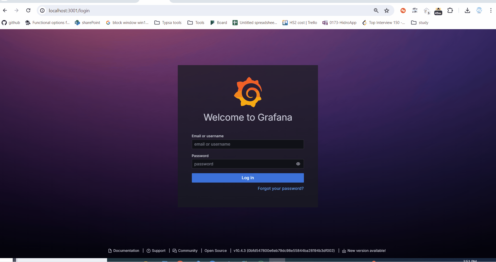

# Log ingestor + CLI to query logs + Grafana dashboard

## Log ingestor
- Accepts logs of format:
    ```
   {
	"level": "error",
	"message": "Failed to connect to DB",
    "resourceId": "server-1234",
	"timestamp": "2023-09-15T08:00:00Z",
	"traceId": "abc-xyz-123",
    "spanId": "span-456",
    "commit": "5e5342f",
    "metadata": {
        "parentResourceId": "server-0987"
    }
    }
    ```
- Logs are ingested via HTTP POST requests to `http://localhost:3000/add` endpoint

## CLI
- CLI to query logs
- You can query logs by:
    - `level`
    - `resourceId`
    - `timestamp`
    - `traceId`
    - `spanId`
    - `commit`
    - `parentResourceId`
- CLI should be able to query logs by any combination of above fields
- CLI should be able to query logs with multiple filters
- CLI should be able to query by a regex pattern
- CLI should be able to query logs by range of timestamps
Examples:
    - `find --filter "level=ERROR" --resourceId=server-1234`
    - `find --filter "level=ERROR" --filter="This is a message 1"`
    - `find -r ".RROR"`
    - `find --filter "timestamp=>2023-09-15T08:00:00Z" --timestamp=<2023-09-15T08:00:00Z`


## Grafana dashboard
- Grafana dashboard to visualize logs
- Grafana dashboard shows the latency of the log ingestor server, number of logs ingested per second, CPU usage, and the status of mongodb

### How to setup the dashboard
- Run docker-compose
    ```
    make run-all
    ```
- Open Grafana dashboard at `http://localhost:3001`
- Login with username `admin` and password `admin`
- Add a new datasource with prometheus at `http://prometheus:9090`
- Import the dashboard from `dashboard-grafana.json`
- Select the datasource inserted in the previous step




## How to run
### Pre-requisites
- Docker
- Docker-compose
- Go 1.22

### Run the log ingestor and populate with logs
- Run the log ingestor and populate.go
    ```
    make run-all
    ```
### Build the CLI
- Build the CLI
    ```
    make install-cli
    ```
- Run the CLI
    ```
    ./bin/cli.exe --filter "level=ERROR" --resourceId=server-1234
    ```
### Open Grafana dashboard
- Open Grafana dashboard at `http://localhost:3001`
